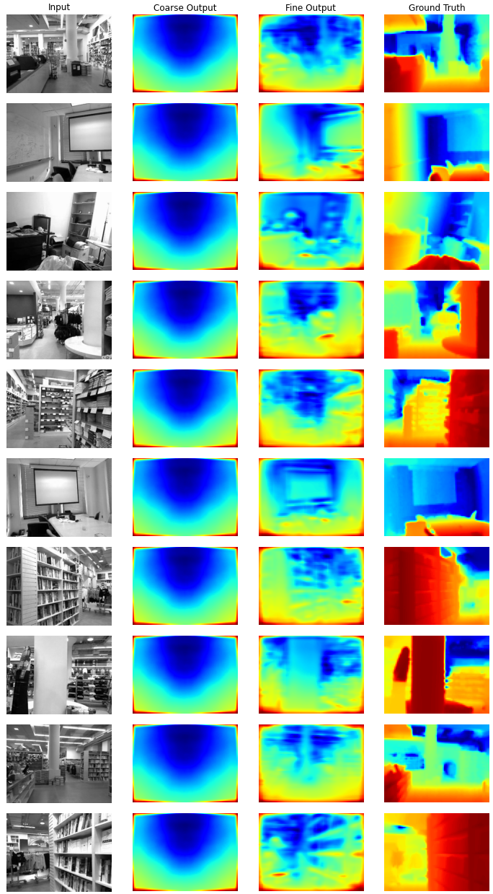
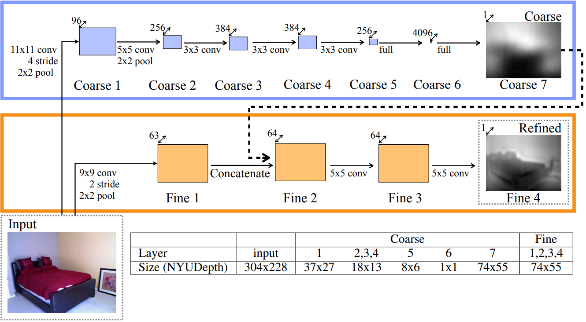

# A Deep Learning Approach to Single-Image Depth Prediction

## Selected Results

## Overview
Depth information is essential to numerous computer vision tasks, from autonomous driving to augmented reality. Traditional methods of depth estimation, such as
LIDAR and RGBD cameras, can be expensive, large, and susceptible to adverse weather conditions. 

This project implements an approach to depth prediction which extracts depth estimates from single images using a multi-scale deep network.
This method may alleviate some of the drawbacks of traditional methods while providing reasonably accurate, useful data.  

The network implemented in this project was first proposed by Eigen et al [1]. 

More detailed information can be found in our research paper MonocularDepthPred.pdf (stored in this repository).

## Network

The network proposed by Eigen et al [1].  

Our network is composed of two convolutional neural networks, a coarse network and a fine network, which are used in conjunction to predict the depth of an image. The image is
first fed through the coarse network, which outputs a depth prediction at the global scale. 
The image and the output of the coarse network are then fed into the fine network, which outputs a final depth map prediction for the entire image.

## Training
The model is trained on the NYU Depth V1 labeled dataset [2]. We use 800 randomly selected image-depth pairs, partitioned into a training set of 640 pairs,
with the remainder serving as a validation set.

## Dataset
The NYU Depth V1 labeled dataset contains, among other variables, 2284 still images and their associated depths, which were recorded by the RGB and Depth cameras from a Microsoft Kinect [2].

## References
[1] https://arxiv.org/abs/1406.2283  

[2] https://cs.nyu.edu/~silberman/datasets/nyu_depth_v1.html
